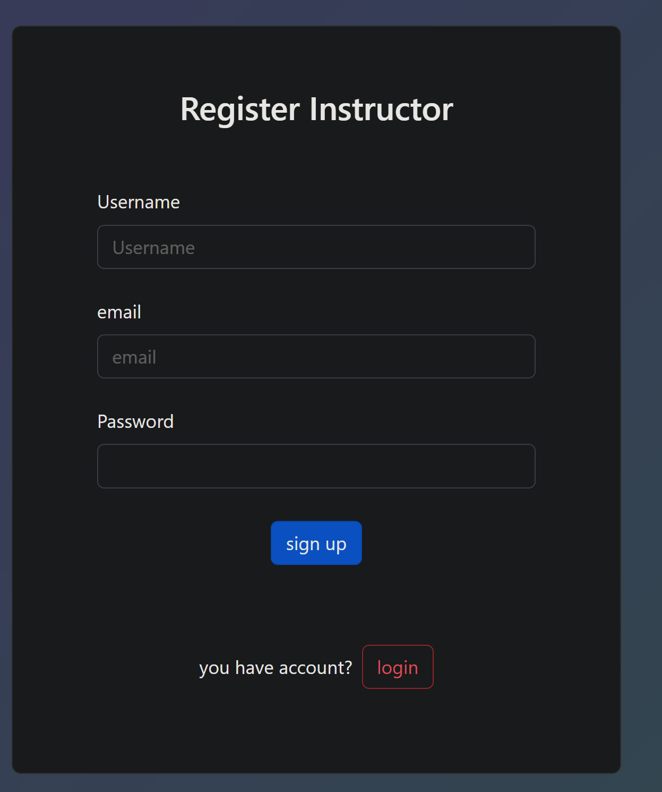
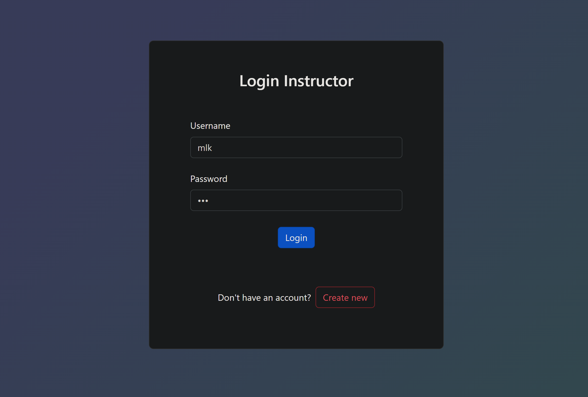
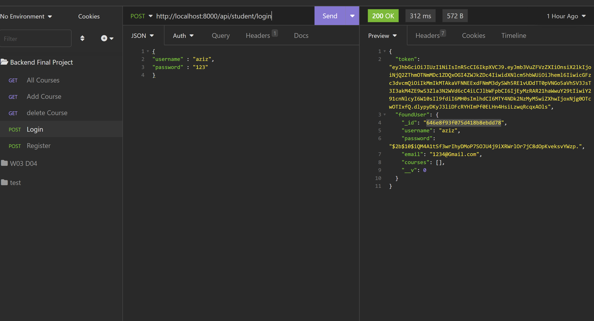
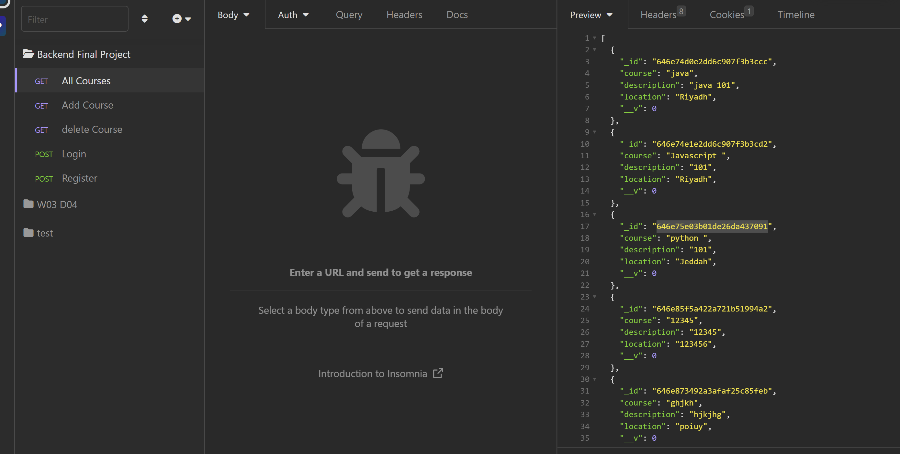
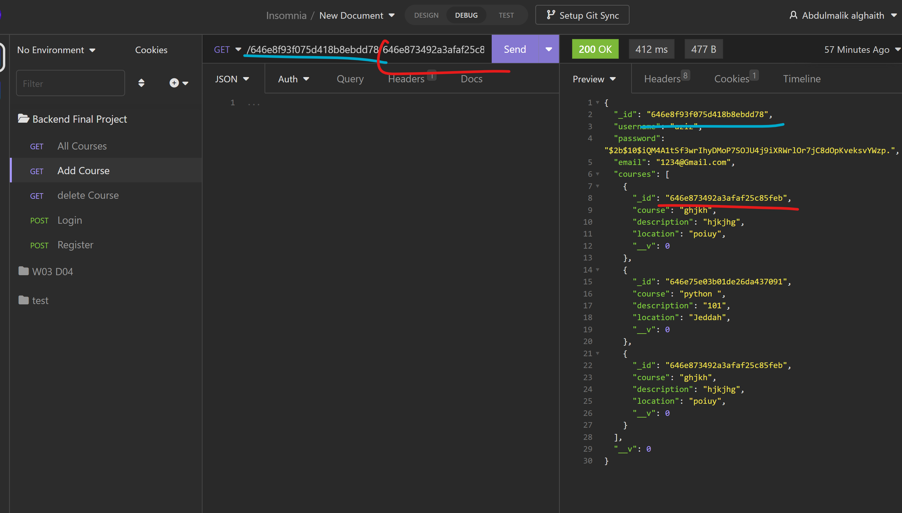

# LMS: is a software application that helps you create, manage, and deliver online courses or training programs.

# Features:

- page register and login for Instructor
- have bcrypt for save password Instructor
- can Instructor create course
- can update course
- can delete course
- can see details course
- can user register and login from api and have bcrypt for save data user
- can add any courses he need from api
- can user cancelled course from api

# Used technologies

- mongoose
- express
- ejs
- HTML & CSS
- bootstrap

# photo

### here Register

### here login

### here ui for Instructor

# how can use api

#### copy id user

#### copy id course

#### copy id course

